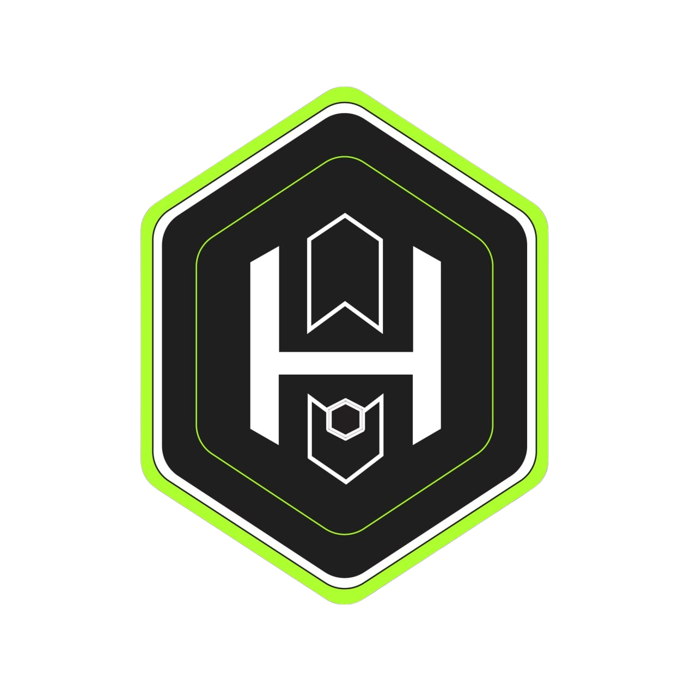

<!-- PROJECT LOGO -->
 

  

  

  

        
    

    
  <picture></picture><b>ACERCA DE NOSOTROS</b>
    

  - Somos Una plataforma descentralizada donde puedes 
    ofrecer tus servicios y encontrar exactamente 
    lo que necesitas, eliminando intermediarios.

  - En nosotros tambien encontraras una forma de 
    darle utilidad a tu token de liquidez.

    

  

  ## <b> Estadisticas de Github </b> 

  <a href="https://github.com/Habilidash/">

  
  

    
  

<!-- TABLE OF CONTENTS -->
<!-- 

  <ol>
    <li>
      <a href="">Acerca del proyecto</a>
      <ul>
        <li></li>
      </ul>
    </li>
    <li>
      <a href="#getting-started">Getting Started</a>
      <ul>
        <li><a href="#prerequisites">Prerequisites</a></li>
        <li><a href="#installation">Installation</a></li>
      </ul>
    </li>
    <li><a href="#usage">Usage</a></li>
    <li><a href="#roadmap">Roadmap</a></li>
    <li><a href="#contributing">Contributing</a></li>
    <li><a href="#license">License</a></li>
    <li><a href="#contact">Contact</a></li>
    <li><a href="#acknowledgments">Acknowledgments</a></li>
  </ol>

 -->

<!-- 
(<a href="#readme-top">back to top</a>)
 -->

<!-- ### Trabajamos con

Aca mostramos los lenguajes y los protocolos que utilizamos en el proyecto. 

 [![React][React.js]][React-url] -->

<!-- 

(<a href="#readme-top">back to top</a>)
 -->

<!-- GETTING STARTED -->

